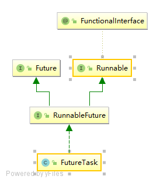

##了解 Future 
他是一个接口，表示 一个异步运算的结果，提供的方法是为了检查任务是否完成，若没有，就等他完成。可获得计算的结果。通过 get 方法获得结果，若任务没有完成，会 block.

```
//参数为 true 表示正在执行任务的线程可能被打断，返回 false 表示任务已经完成，无法取消
 boolean cancel(boolean mayInterruptIfRunning);
    //取消成功 返回 true
  boolean isDone();
  //任务 完成 返回true
  boolean isDone();
```
```
V get() throws InterruptedException, ExecutionException;
//可设置等待的时间
V get(long timeout, TimeUnit unit)
        throws InterruptedException, ExecutionException, TimeoutException;
```
##FutureTask
他实现了 RunnableFuture:是 Runnable 和 Future 2个接口的 合体。

